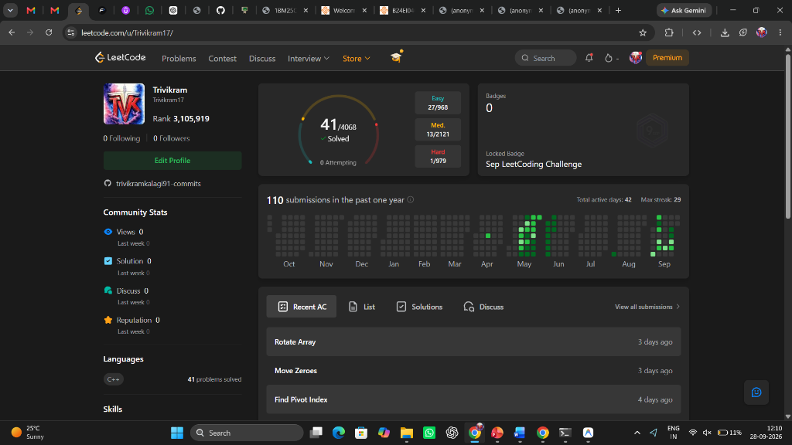

# LeetCode Solutions & Practice Log

**Student Name:** Trivikram Kalagi  
**Roll Number:** R25EJ164  
**Course:** Portfolio Building (B25CS0311 / B25GE0101)  
**Description:** Personal LeetCode practice log — part of B25GE0101 portfolio artifact.

---

## 📌 Overview

This repository serves as a version-controlled portfolio log of solved LeetCode problems spanning core data structures and algorithmic paradigms.

Every problem in this repository follows a strict **Portfolio-Quality Standard**:
1. **Local Test Suite:** Written and tested locally in C++ with at least two test cases prior to submission.
2. **Per-Problem Documentation:** Includes approach breakdown, time/space complexity analysis, and edge case insights (`.md`).
3. **Verified Submission Screenshots:** Proof of "Accepted" status on LeetCode (`.png`) for taught core topics.
4. **Growth Tracker:** Detailed progress tracking in [PROGRESS.md](PROGRESS.md).

---

## 📂 Table of Contents

### 1. 🔤 [Arrays & Strings](arrays-strings/)
| # | Problem | Difficulty | Code | Documentation | Result |
| :-: | :--- | :-: | :-: | :-: | :-: |
| 01 | [Two Sum](https://leetcode.com/problems/two-sum/) | Easy | [01-two-sum.cpp](arrays-strings/01-two-sum.cpp) | [01-two-sum.md](arrays-strings/01-two-sum.md) | [Screenshot](arrays-strings/01-result.png) |
| 02 | [Reverse String](https://leetcode.com/problems/reverse-string/) | Easy | [02-reverse-string.cpp](arrays-strings/02-reverse-string.cpp) | [02-reverse-string.md](arrays-strings/02-reverse-string.md) | [Screenshot](arrays-strings/02-result.png) |
| 03 | [Valid Anagram](https://leetcode.com/problems/valid-anagram/) | Easy | [03-valid-anagram.cpp](arrays-strings/03-valid-anagram.cpp) | [03-valid-anagram.md](arrays-strings/03-valid-anagram.md) | [Screenshot](arrays-strings/03-result.png) |
| 04 | [Best Time to Buy and Sell Stock](https://leetcode.com/problems/best-time-to-buy-and-sell-stock/) | Easy–Medium | [04-best-time-to-buy-and-sell-stock.cpp](arrays-strings/04-best-time-to-buy-and-sell-stock.cpp) | [04-best-time-to-buy-and-sell-stock.md](arrays-strings/04-best-time-to-buy-and-sell-stock.md) | [Screenshot](arrays-strings/04-result.png) |
| 05 | [Longest Common Prefix](https://leetcode.com/problems/longest-common-prefix/) | Easy–Medium | [05-longest-common-prefix.cpp](arrays-strings/05-longest-common-prefix.cpp) | [05-longest-common-prefix.md](arrays-strings/05-longest-common-prefix.md) | [Screenshot](arrays-strings/05-result.png) |

---

### 2. ⚡ [Basic Algorithms](basic-algorithms/)
| # | Problem | Difficulty | Code | Documentation | Result |
| :-: | :--- | :-: | :-: | :-: | :-: |
| 06 | [Binary Search](https://leetcode.com/problems/binary-search/) | Easy–Medium | [06-binary-search.cpp](basic-algorithms/06-binary-search.cpp) | [06-binary-search.md](basic-algorithms/06-binary-search.md) | [Screenshot](basic-algorithms/06-result.png) |
| 07 | [Move Zeroes](https://leetcode.com/problems/move-zeroes/) | Easy–Medium | [07-move-zeroes.cpp](basic-algorithms/07-move-zeroes.cpp) | [07-move-zeroes.md](basic-algorithms/07-move-zeroes.md) | [Screenshot](basic-algorithms/07-result.png) |

---

### 3. 🥞 [Stacks](stacks/) *(Topic Not Taught Yet)*
| # | Problem | Difficulty | Code | Documentation | Result |
| :-: | :--- | :-: | :-: | :-: | :-: |
| 08 | [Valid Parentheses](https://leetcode.com/problems/valid-parentheses/) | Easy–Medium | [08-valid-parentheses.cpp](stacks/08-valid-parentheses.cpp) | [08-valid-parentheses.md](stacks/08-valid-parentheses.md) | *[Topic Not Taught Yet]* |

---

### 4. 🔗 [Linked Lists](linked-lists/) *(Topic Not Taught Yet)*
| # | Problem | Difficulty | Code | Documentation | Result |
| :-: | :--- | :-: | :-: | :-: | :-: |
| 09 | [Reverse Linked List](https://leetcode.com/problems/reverse-linked-list/) | Easy–Medium | [09-reverse-linked-list.cpp](linked-lists/09-reverse-linked-list.cpp) | [09-reverse-linked-list.md](linked-lists/09-reverse-linked-list.md) | *[Topic Not Taught Yet]* |

---

## 👤 LeetCode Account Profile Verification


---

## 🛠️ How to Run Tests Locally

All solutions are standalone C++ programs containing test harnesses in `main()`.

To compile and execute any solution locally using `g++`:

```bash
g++ -std=c++17 arrays-strings/01-two-sum.cpp -o test
./test
```